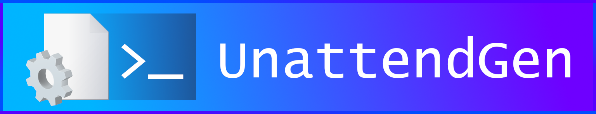

**UnattendGen** is a console application that generates unattended answer files given certain parameters.

## Licenses

- **Program:** GNU GPLv3
- **Library:** MIT

This project uses Christoph Schneegans' unattended answer file generation library for core functionality. Its license file, including its source files, can be found in the `Library` folder.

## Usage

When running the program with the `/?` argument, you will see the following usage pattern:

```
UnattendGen [/target=<targetPath>] [/regionfile=<regionFile>] [/architecture={ x86 ; i386 | x64 ; amd64 | aarch64 ; arm64 }] [/LabConfig] [/BypassNRO] [/computername=<compName>] [/tzImplicit] [/partmode={ interactive | unattended | custom }] [/generic | /customkey=<key>] [/msa] [/customusers] [/autologon={ firstadmin | builtinadmin }] [/b64obscure] [/pwExpire=<days>] [/lockout={ yes | no } [/vm={ vbox_gas | vmware | virtio }] [/wifi={ yes | no }] [/telem={ yes | no }] /customcomponents
```

When running the program with no arguments, it will generate a basic answer file with default settings. If you want to avoid this behavior and create your custom answer file, you will need to pass the appropriate switches.

### Switches

**General switches**

| Switch | Action |
|:--:|:--|
| `/target` | Saves the answer file to the path defined in `<targetPath>`. If this switch is not passed, UnattendGen will save the answer file to `unattend.xml` in the program directory |

**Regional settings**

| Switch | Action |
|:--:|:--|
| `/regionfile` | Configures regional settings based on the XML configuration file that you will need to create manually. Read the Configuration Files section for more information. If this switch is not passed, UnattendGen will use interactive settings (which will make Setup ask you) |

**Basic system settings**

| Switch | Action |
|:--:|:--|
| `/architecture` | Configures the system architecture to use with the unattended answer file. You can choose either of the following options: `x86` or `i386` for 32-bit systems (use therefore with Windows 10), `x64` or `amd64` for 64-bit systems; or `aarch64` or `arm64` for ARM-based chips (usually found in single-board computers (SBCs)) (use with Windows on ARM only). If this switch is not passed, UnattendGen will default to `amd64` |
| `/LabConfig` | Configures registry keys that enable you to bypass the system requirement checks for Windows 11 Setup. If this switch is not passed, these settings are not configured. Otherwise, the target file must be used only on Windows 11 |
| `/BypassNRO` | Configures registry keys that enable you to bypass the mandatory network connection setup of the Out-of-box Experience (OOBE) for Windows 11. If this switch is not passed, these settings are not configured. Otherwise, the target file must be used only on Windows 11. Also note that this may not work on version 24H2 |
| `/computername` | Configures the name of the computer using the value defined in `<compName>`. If this switch is not passed, a random computer name will be chosen |

**Time zone settings**

| Switch | Action |
|:--:|:--|
| `/tzImplicit` | Configures the system to determine the time zone from the regional settings chosen with `/regionfile`. If this switch is not passed, UnattendGen will configure the time zone based on your configuration |

**Disk configuration settings**

| Switch | Action |
|:--:|:--|
| `/partmode` | Sets the disk configuration mode. You can choose either of the following options: `interactive` (Setup will ask you), `unattended` (configures options for Disk 0 based on a configuration file); or `custom` (configures options for disks and partitions using a DiskPart configuration file). If this switch is not passed, UnattendGen will use interactive settings |

**Edition settings**

> [!NOTE]
> Don't use both switches as one will take more precedence than the other

| Switch | Action |
|:--:|:--|
| `/generic` | Configures the edition of the installation based on a configuration file. If this switch is not passed, UnattendGen will use a generic Pro edition |
| `/customkey` | Configures the edition of the installation based on a product key defined in `<key>`. **Make sure your product key is valid before passing it** |

**User settings**

> [!NOTE]
> If you don't specify `/customusers`, you will not be able to use `/autologon` and/or `/b64obscure`

| Switch | Action |
|:--:|:--|
| `/msa` | Configures the target system to ask for a Microsoft account |
| `/customusers` | Configures user accounts based on a configuration file. If this switch is not specified, UnattendGen will use interactive settings |
| `/autologon` | Configures autologon settings. You can use either of the following options: `firstadmin` (Setup will use the first administrator account in the user configuration file), or `builtinadmin` (Setup will use the built-in Administrator account with the password defined in a configuration file). This switch requires `/customusers`, and, if not set, UnattendGen will disable autologon |
| `/b64obscure` | Configures user passwords to be obscured with Base64. This switch requires `/customusers` |
| `/pwExpire` | Configures user passwords to be expired after an amount of days defined in `<days>` (this is not recommended by NIST) |
| `/lockout` | Configures Account Lockout settings for users. You can specify either `yes` (to configure these settings with a configuration file) or `no` (to disable Lockout policies - not recommended). If this switch is not passed, UnattendGen will use default policies |

**Virtual Machine support**

| Switch | Action |
|:--:|:--|
| `/vm` | Configures Virtual Machine support based on a provider. You can use either of the following options: `vbox_gas` (use with VirtualBox), `vmware` (use with VMware hypervisors); or `virtio` (use with QEMU-based hypervisors). If this switch is not specified, UnattendGen will disable enhanced support from your VM provider |

**Wireless settings**

| Switch | Action |
|:--:|:--|
| `/wifi` | Configures wireless network settings. You can specify either `yes` (to configure these settings with a configuration file) or `no` (to skip this configuration). If this switch is not specified, UnattendGen will use interactive settings |

**System telemetry**

| Switch | Action |
|:--:|:--|
| `/telem` | Configures system telemetry settings. You can specify either `yes` (to enable telemetry) or `no` (to (attempt to) disable telemetry). If this switch is not specified, UnattendGen will use interactive settings |

**Component configuration**

| Switch | Action |
|:--:|:--|
| `/customcomponents` | Configures custom components using a configuration file. If this switch is not specified, UnattendGen will use default configurations and passes |

### Configuration files

You can look at example configuration files with the following links:

- [Regional configuration](https://github.com/CodingWonders/UnattendGen/blob/master/Tests/regionTest.xml)
- [Disk 0 Settings](https://github.com/CodingWonders/UnattendGen/blob/master/Tests/unattPartSettings.xml)
- [DiskPart settings](https://github.com/CodingWonders/UnattendGen/blob/master/Tests/diskPartSettings.xml)
- [Generic edition settings](https://github.com/CodingWonders/UnattendGen/blob/master/Tests/edition.xml)
- [User accounts](https://github.com/CodingWonders/UnattendGen/blob/master/Tests/userAccounts.xml)
- [Built-in Admin autologon settings](https://github.com/CodingWonders/UnattendGen/blob/master/Tests/autoLogon.xml)
- [Lockout settings](https://github.com/CodingWonders/UnattendGen/blob/master/Tests/lockout.xml)
- [Wireless settings](https://github.com/CodingWonders/UnattendGen/blob/master/Tests/wireless.xml)
- [Custom configuration](https://github.com/CodingWonders/UnattendGen/blob/master/Tests/components.xml)


## Building

**Requirements:** [.NET 9 SDK](https://dotnet.microsoft.com/en-us/download/dotnet/thank-you/sdk-9.0.101-windows-x64-installer), Visual Studio 2022, version 17.12 or later

### Initializing submodules

This repository uses submodules, which you can initialize by running the following commands:

- `git submodule init` (clones all submodules)
- `git submodule update` (updates the submodules to their latest commits)

- You can also clone the repository while passing the `--recurse-submodules` flag for a simple one-liner!

Learn more [here](https://git-scm.com/book/en/v2/Git-Tools-Submodules)

### Building the project

1. Open the project
2. Click Build -> Build solution, or press CTRL+SHIFT+B

## Contributing

1. Fork this repository
2. Work on your changes **AND TEST THEM**
3. Commit the changes and push them
4. Make a pull request
